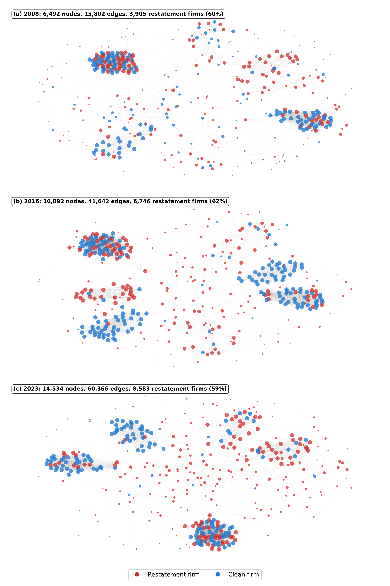
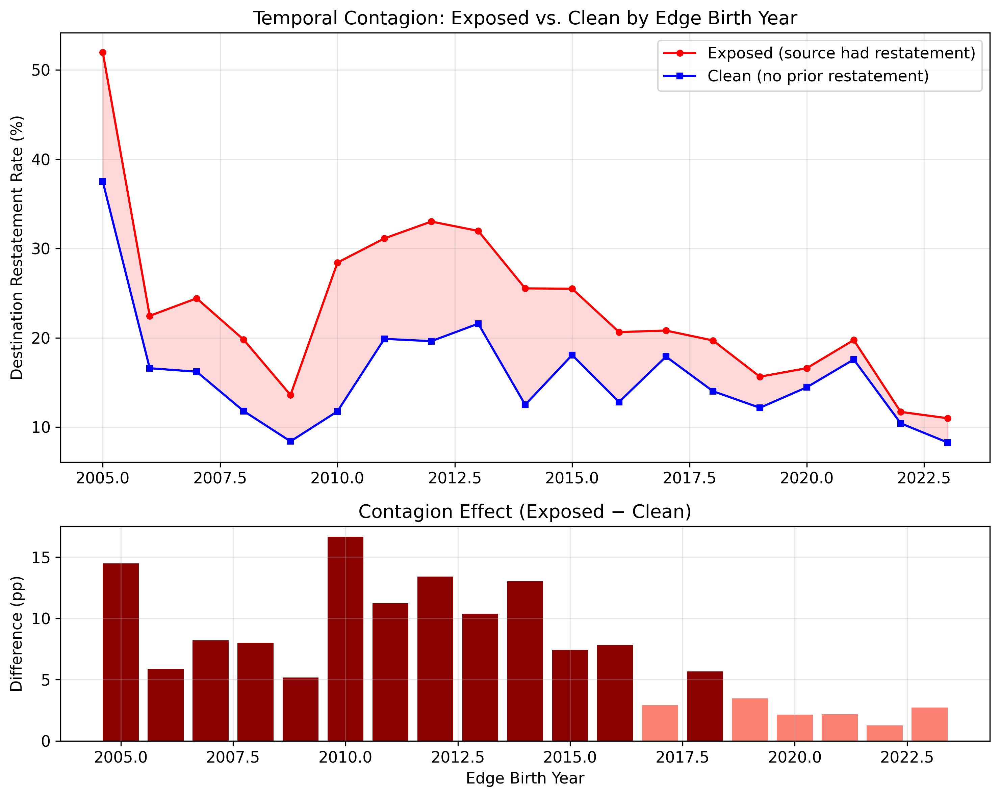
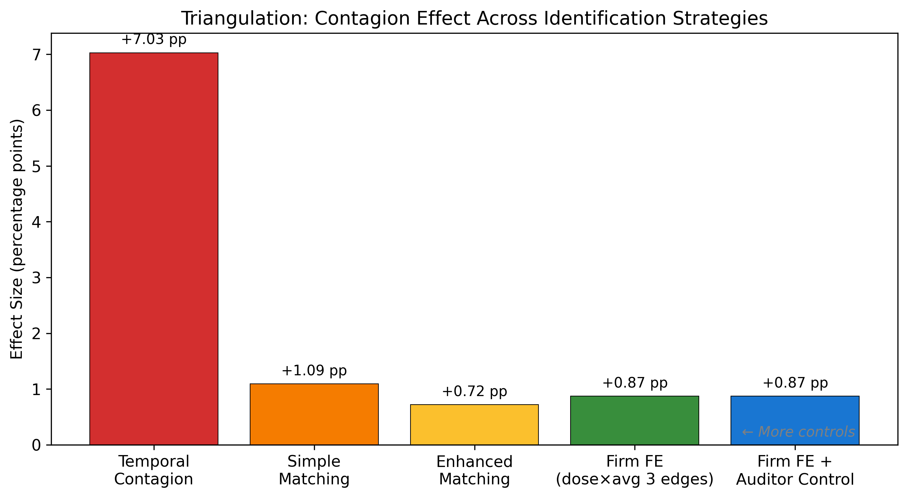

# Board Interlock Networks and Accounting Risk

[](https://doi.org/10.5281/zenodo.18872817)

Replication code for:

> **"The Dark Side of Connectivity: How Board Interlock Networks Are Associated with Accounting Risk Through Director Mobility"**
>
> Jihwan Woo and Nari Kim
>
> *Journal of Business Research* (2026, submitted)

## Overview

We track how director mobility creates and dissolves board interlock edges over 20 years (2004–2023), and test whether restatement risk co-moves through these temporal connections. Using 561,306 director events and 154,920 edge lifecycles from WRDS, we find that firms receiving directors from restatement companies face significantly higher subsequent restatement risk — an effect that survives multiple identification strategies.

### Board Interlock Network Evolution


*Board interlock networks at three time points. Red = restatement firms; blue = clean firms. The network grows denser over time, and restatement firms are distributed throughout.*

### Temporal Contagion: Declining Over Time


*Top: Restatement rates for exposed (red) vs. clean (blue) groups. Bottom: Difference in percentage points. The contagion effect peaks in 2010–2014 and declines thereafter.*

### Triangulation Across Identification Strategies


*Effect size decreases monotonically as controls become more stringent, while statistical significance is maintained — characteristic of a robust finding.*

## Key Findings

| Hypothesis | Finding | Effect Size | p-value |
|:---:|--------|:---:|:---:|
| H1 | Temporal contagion exists | +7.0 pp (exposed vs clean) | < 0.001 |
| H2 | Dose-response relationship | +0.25 pp per exposed edge | < 0.001 |
| H3 | Contagion declines over time | +12.9 pp (2010–14) → +2.1 pp (2020–23) | < 0.001 |
| H4 | Contaminated edges dissolve faster | −0.95 years | < 0.001 |
| H5 | Cross-community edges transmit more | +3.7 pp (cross vs within) | < 0.001 |

### Robustness

| Test | Result |
|------|--------|
| Strict fraud (SEC investigation / fraud) | Significant (p < 0.001) |
| Multiple contagion windows (0, 1, 2, 3 yr) | All significant |
| Non-executive directors | Strongest effect (+9.9 pp) |
| Same-auditor control | Effect persists for different-auditor pairs (+4.2 pp) |
| Industry × Year FE | Key variable remains significant (t = 3.32) |
| Logit specification | Marginal effect confirms LPM |

## Data

All data are sourced from **Wharton Research Data Services (WRDS)** and require an institutional subscription. **Data are not included in this repository due to licensing restrictions.**

| Dataset | WRDS Table | Records |
|---------|-----------|:---:|
| Directors & Officers | `audit.feed17_director_and_officer_changes` | 561,306 |
| Restatements | `audit.feed39_financial_restatements` | 28,662 events |
| Auditor-Company | `audit.feed01_audit_opinions` | 71,480 |
| Compustat Financials | `comp.funda` | 48,110 firm-years |

## Replication

### Prerequisites

```bash
pip install wrds pandas numpy networkx scipy matplotlib
```

### Steps

```bash
# 1. Download data from WRDS (requires credentials)
python code/00_download_wrds_data.py

# 2. Build yearly interlock networks and edge lifecycles
python code/01_build_edge_lifecycles.py

# 3. Temporal contagion analysis (H1, H3, H4)
python code/02_temporal_contagion.py

# 4. Firm FE regression and matched counterfactual (H2)
python code/03_causal_analysis.py

# 5. Robustness tests
python code/04_robustness.py
```

All scripts include checkpoint functionality — if interrupted, re-running resumes from the last completed step.

### Output

Results are saved as JSON files in `results/`:

| File | Contents |
|------|----------|
| `temporal_network_results.json` | H1, H3, H4 results |
| `causal_analysis_results.json` | H2 (Firm FE + matching) |
| `robustness_results.json` | Strict fraud, windows, Industry×Year FE |
| `community_detection_results.json` | H5 (community structure) |
| `reviewer_response_results.json` | Director roles, same-auditor, restatement types |
| `dynamic_network_results.json` | Edge birth analysis |

## License

Code: [MIT License](LICENSE)

Data: Not included. Available from [WRDS](https://wrds-www.wharton.upenn.edu/) with institutional subscription.

## Citation

```bibtex
@article{woo2026darkside,
  title={The Dark Side of Connectivity: How Board Interlock Networks Are Associated 
         with Accounting Risk Through Director Mobility},
  author={Woo, Jihwan and Kim, Nari},
  journal={Journal of Business Research},
  year={2026},
  doi={10.5281/zenodo.18872817},
  note={Submitted}
}
```
